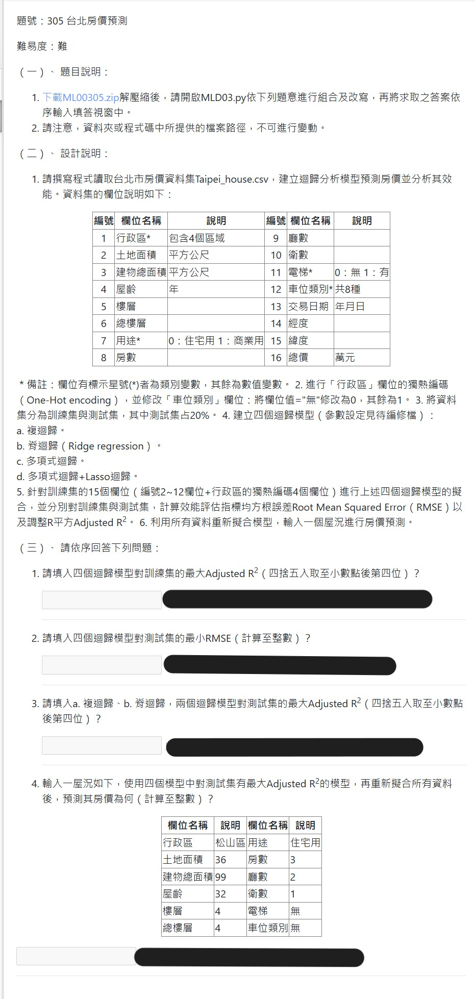

## 特別注意
 - 第三題的值會因為寫法不同導致相異執行結果，但兩者皆分別為標準答案與緩衝區間的答案。

```
print(f"對測試集的最小 RMSE: {min(evaluation['RMSE (test)']):0.f}")
```
與
```
print(f"對測試集的最小 RMSE: {int(min(evaluation['RMSE (test)']))}")
```
執行結果有微小不同！

## 解題提示
 - one-hot encoding，pandas 就有，pandas.get_dummies(資料, columns = ['欄位名稱'])
 - 脊迴歸(Ridge regression)，選類別那個，不是函式那個
 - PolynomialFeatures 僅僅是轉換特徵作用，非分類模型
 - 太多層洋蔥，會搞到自己，逐步進行。
 - 
