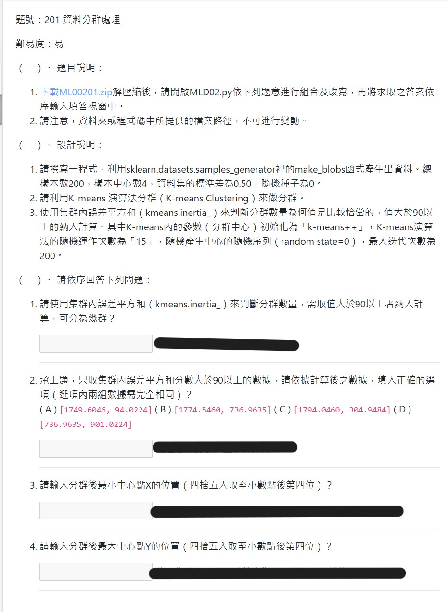

## 特別注意
 - 第一題，找出 **第一個** 大於 90 以上的分群數。
 - 第二題，大於 90 以上的分群數數據（選項內是任抓兩群的誤差平方和），誤差平方和必須 **完全相同**！
 - 最小 X 座標值。
 - 最大 Y 座標值。

## 解題提示
 - make_blobs 使用，若真的不行，善用 print(help(欲查詢物件或類別))
 - 分群後中心點查找，留意迴圈走訪的細節
 