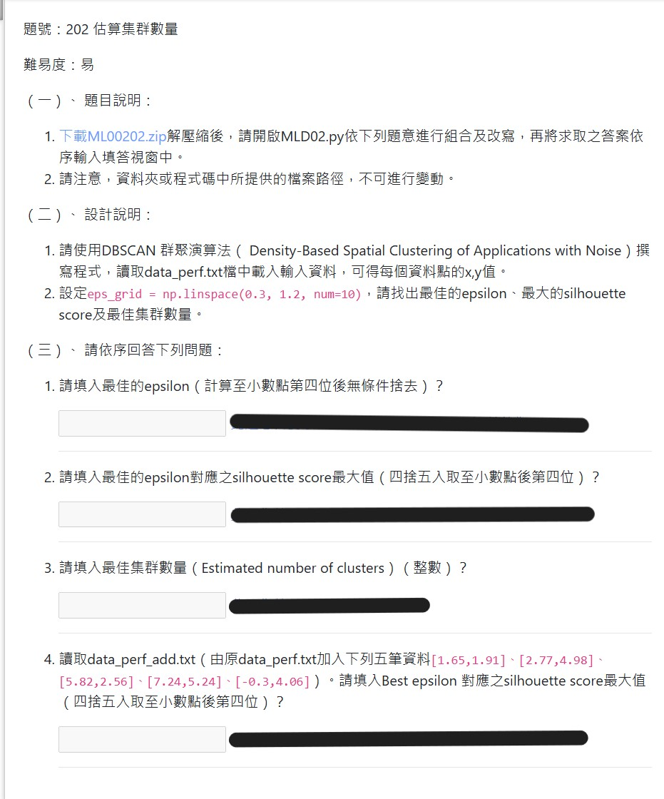

## 特別注意
 - 勢必會優先找到最大 silhouette_score 的答案
 - "4."的題意:
   1. 更新資料來源，以至今最佳模型擬和新數據，找到 silhouette_score

   > 一個模型就一個 silhouette_score 而已，何來 silhouette_score 最大值？

   2. 更新資料來源，再逐個重新擬和，尋找新數據下的最佳模型，找到 silhouette_score

   > Best epsilon 由找到最大值 silhouette_score 產生。

## 解題提示
 - silhouette_score 使用