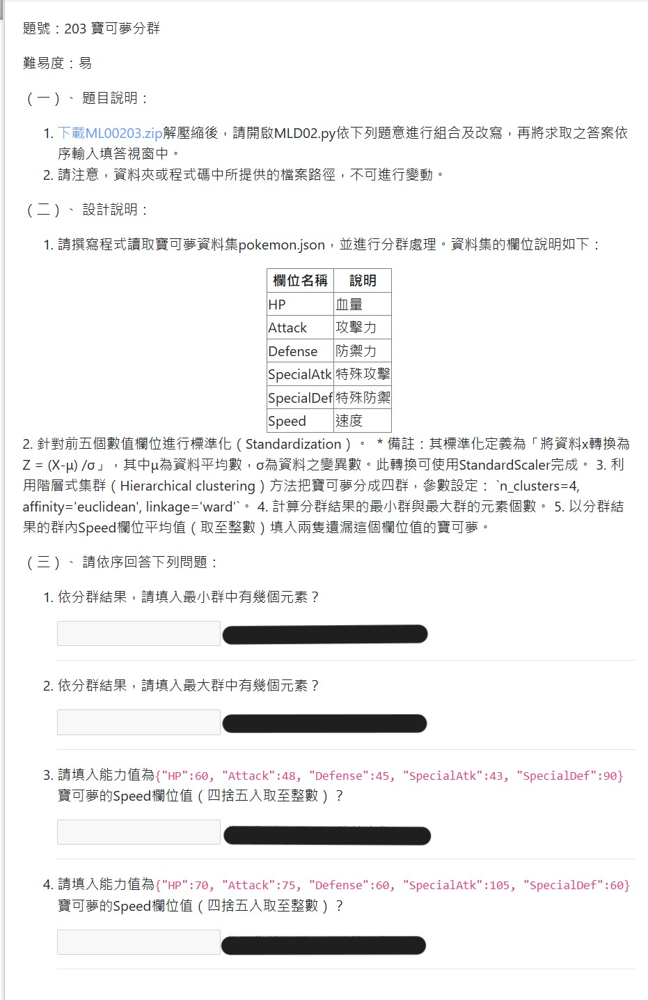

## 特別注意
 - 注意到設計說明順序，第五點要求以分群結果的 **群內** Speed 均值至整數，作為補缺漏值。因此應是：
   1. 先分群
   2. 得 **群平均**
   3. 再補值

 > 作者當時誤會，以為先補 **全部平均值** 再回答末兩題（而有列出來就會知道，末兩題就是遺失值的那兩筆，因此感到相當匪夷所思～）。
 > 參考答案 MLA02-1.py 並沒有完成補值動作（反正是回答選擇題...）！