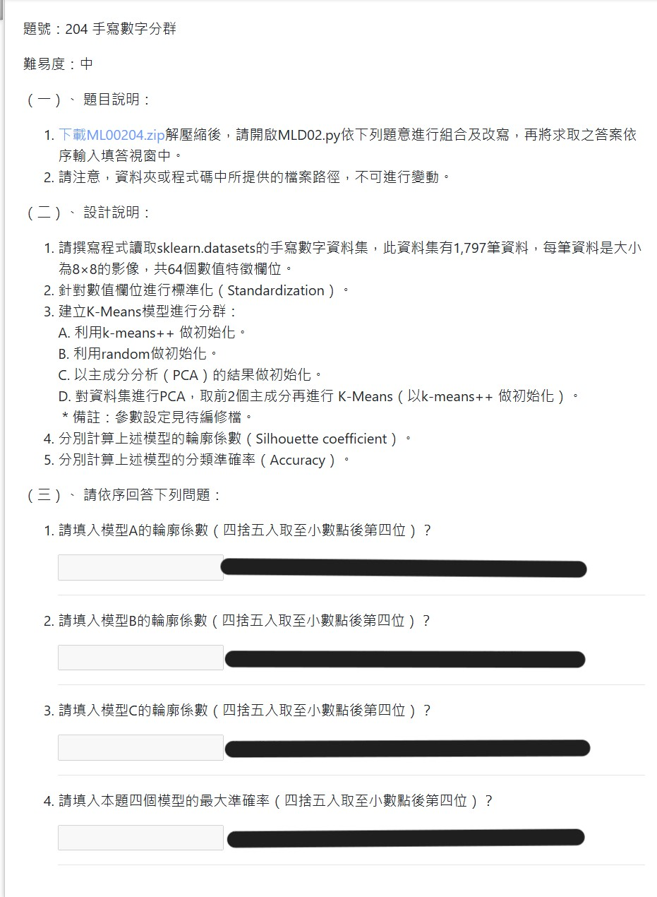

## 特別注意
 - 參考答案 MLA02-1.py 有按題意完成作答，但同樣程式碼，過去與現今執行結果完全不同。
 - [參考答案2](https://www.youtube.com/watch?v=oZTvI-QTqc4&ab_channel=wilson) 在最後一個 kmeans 模型 **並未採用 PCA 後的數據進行 fit**，因此結果會與模型 A 相同。
 - 也就是說，持續維持現狀下，該題分數**確定拿不到**。
